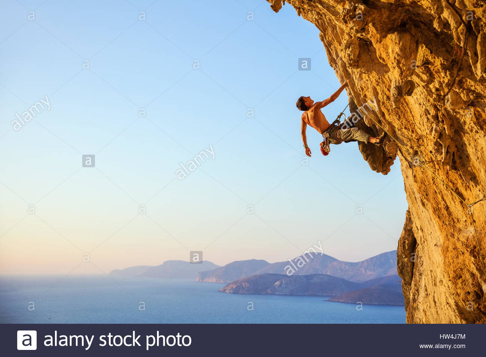
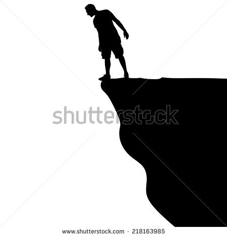

= Understanding Git

== Imagine

Imagine a video game world, consisting of three parts:

* In the water - *working directory*
* On the shore - *the index*
* On the cliff top - *the HEAD*

NOTE: There are more worlds in this universe, let's start there ;)

== My personal Git world

image::slide-imgs/multiworld.jpg[width=20%]

You can delete/mess up your Git world at any time:

* other worlds (eg GitHub) are not affected
* you can recreate the world easily

== Into the water

After cloning a repo, you can start changing files. 
In that Git world game, that's like being in the water:

video::LcFpn-LMerk[youtube]

=== Explore

The water environment is volatile, but resources are available:

* create artifacts
* abundant resources

=== Collect and use tools

Whatever you want to do, there are resources available to you.

=== Travel freely and collect fish

You can move freely and collect as many fish as you want.
There are no restrictions.

=== Get to the shore

When you decide that you've played enough, you can either

* bring all the fish you collected
* dump the fish that are freely available in the water

NOTE: Typically, the strategy is to ony keep the fish you value.

== On the shore

(staging in real Git)
You have a mobile phone with GPS, 
but the shadow of the cliff prevents you from receiving a signal.

Most folk choose to go <<On the cliff top>>.

=== Return to the water from the shore

If you return to the water, you can end up confused. 
For example, you can end up with some fish on one part of the shore and the same fish on another part.
Strange things can happen whenever you try this.
(once you stage files in Git, probably best to commit them)

== On the cliff top

(commit in real Git)
On the cliff top, you have a GPS signal, and can view your coordinates:

* They look weird: 4271d8308e2c85dd78ee0065d283647265db2a19
* You've got no map
* You can only ever see the previous coordinates clearly

=== Beacons

Whenever you reach the cliff top, you leave the fish and a GPS beacon at that site.

=== Where can you go?

You cannot move, your only choice is to dive back <<Into the water>>.

NOTE: You can return to the beacon at any time, if you have the correct coordinates.

== Recording geography

While the resources in this game are in the water, you need to record coordinates to return to fish you've already collected.

You use a notebooks to record the locations. 

While the notebook has many pages, you decide to record the coordinates on a single page you label 'master'.

== Look up

From the water, or shore, it's not a good idea to look up.

But from the cliff top, you can see there are other worlds in the sky.

Those worlds don't have water, they look more like moons. 

You notice that the dry worlds have 'highlands' and 'coasts' with beacons that match your own world

=== Retrieving beacons from other worlds

image::slide-imgs/multiworld.jpg[width=40%]

You find that if you think hard enough you can retrieve beacons from these worlds

=== Projecting beacons 

image::slide-imgs/multiworld.jpg[width=40%]

You find that if you think hard enough you can project your beacons to these worlds

=== How many worlds are there?

Typically, there's a nearby dry world that is easy to retrieve and project beacons to, let's call it the moon.
However, you notice other worlds, dimmer, but whoever is on those worlds is projecting beacons to your moon.

=== Notebooks

Despite the immense distance to the moon, you can read the notebook that's lying on it.
You can see that whenever you project a beacon to it, the notebook is updated, cool!

=== The moon is in flux

The beacons on the moon can change. 
When the notebook on the moon changes, you find it difficult to retrieve the contents down to your world.
If you cannot retrieve the beacons, it makes it difficult to explore new areas of the sea, where there might be treasure.

== Conclusion

There are lots of pages about the three trees of git, for example:

image::https://cms-assets.tutsplus.com/uploads/users/48/posts/28188/image/Three-Trees.jpg[width=30%]

link:https://code.tutsplus.com/tutorials/what-are-the-three-trees-in-git--cms-28188[]
