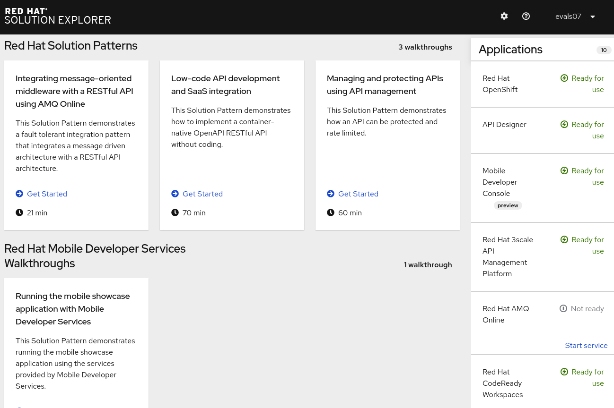
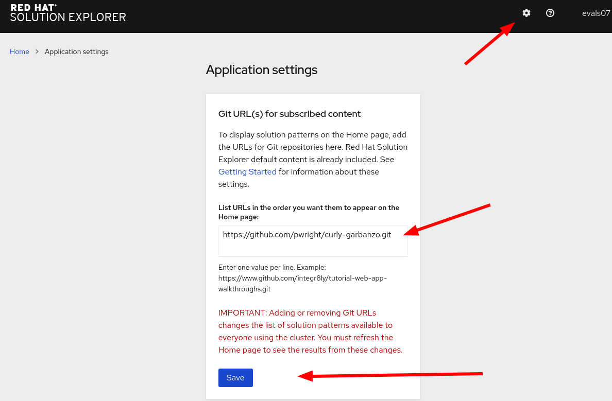

= Creating Solution Patterns without writing text

ifdef::openshift-host[]
:sectnums:

[type=walkthroughResource,serviceName=openshift]
.Red Hat OpenShift
****
* link:https://access.redhat.com/documentation/en-us/red_hat_managed_integration/1/html/getting_started/index#gs-publishing-walkthroughs-proc[Adding Solution Patterns, window="_blank"]
* link:https://access.redhat.com/documentation/en-us/red_hat_managed_integration/1/html/getting_started/index#gs-writing-walkthroughs-proc[Writing Solution Patterns, window="_blank"]
****
endif::openshift-host[]

== Thank You!
https://github.com/pwright/curly-garbanzo

Thank you all for the work on Solution Explorer:

* Short cut to the user
* Reduce friction

=== Imagine

[%step]
* They express how we want a cluster to work (collect user stories tues/wed)
* SOPs are walkthroughs on a QE cluster (get an example SOP)
* They're easy

=== Existing writers

* link:https://github.com/RedHatWorkshops/dayinthelife-integration[Day in the life] workshops
* You ?

== Find a Solution Pattern

Instead of writing, you can find existing files that suit your purpose.

=== Find a user story on customer portal

. Find an AsciiDoc file:
* link:https://access.redhat.com/documentation/en-us/red_hat_fuse/7.4/[Fuse] online -> link:https://github.com/syndesisio/syndesis/tree/master/doc[Upstream docs]
* link:https://access.redhat.com/documentation/en-us/red_hat_amq/7.4/[AMQ] online -> link:https://github.com/EnMasseProject/enmasse/tree/master/documentation[Upstream docs]
* 3scale -> internal only
* link:https://access.redhat.com/documentation/en-us/openshift_dedicated/3/[OSD] -> link:https://github.com/openshift/openshift-docs/tree/dedicated[Upstream docs]

. Copy the source file. 

For example: link:https://raw.githubusercontent.com/openshift/openshift-docs/dedicated-3.2/getting_started/basic_walkthrough.adoc[Basic Walkthrough for OSD]

=== Create a repo from the template

. Navigate to https://github.com/pwright/curly-garbanzo
. Click *Use Template*.

=== Add your file to the repo

. Edit the `/walkthroughs/empty/walkthrough.adoc` file to add your content from step one.
. Rename the directory from `empty` to reflect purpose of your Solution Pattern.
. Commit and push your changes.

=== Add the repo to your cluster

== Dual purposing Solution Patterns

This presentation is a Solution Pattern

See repo and the link:https://asciidoctor.org/docs/asciidoctor-revealjs/#node-javascript-setup[node setup docs].

== Make your Solution Pattern sing

Edit the file to add some generic content:

* menu on right
* verifications

[type=verification]
====
Did it work?
====

[type=verificationFail]
Try the steps again. If it's still not working contact your administrator.

== Is the future here yet?

There's a CCS initiative to make docs modular, meaning that in the future you'll need to assembly your Solution Pattern

* Pro: you can assembly cross product Solution Patterns
* Con: you must assembly a Solution Pattern, you won't find ready-made Solution Patterns in docs

=== Find an assembly you want

. Browse the available modules, eg https://github.com/openshift/openshift-docs/tree/master/modules
. Grab the files you want
. Put them into a directory
. Create an assembly, eg:
+
----
include::<file>[]
----

. Create the walkthrough.adoc
+
----
./bin/assemble.sh walkthroughs/modules/assemby.adoc walkthroughs/modules/walkthrough.adoc
----

== References

* Writing clarifies thinking - https://hbr.org/2016/09/bad-writing-is-destroying-your-companys-productivity